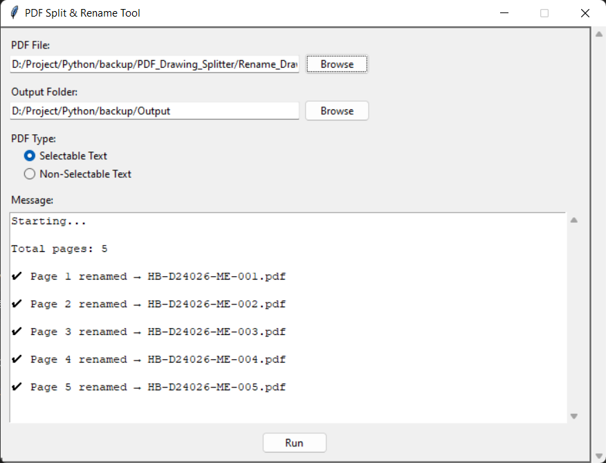

# PDF Drawing Splitter

A desktop Python application for splitting engineering drawing PDFs into individual files and automatically renaming them based on the drawing number and revision found in the document.

This tool is especially useful for document control, engineering archives, and daily file organization where drawing PDFs need to be separated and named consistently.

## Why this app exists

When a PDF contains multiple drawing pages or needs to be processed into a structured archive, manually splitting and renaming each file can be slow and error-prone. This app automates that workflow so you can:

- split a PDF into single-page files
- extract the drawing number from the document text
- detect the revision when available
- rename each output file automatically
- handle scanned or non-selectable PDFs using OCR

## Features

- Select a source PDF file from your computer
- Choose an output folder for the generated files
- Support for both selectable text and non-selectable scanned PDFs
- Automatic extraction of drawing number and revision
- Clean file naming with invalid character handling
- Duplicate-file protection by adding counters when needed
- Simple Tkinter-based desktop interface

## Tech Stack

- Python 3
- Tkinter for the graphical user interface
- PyPDF2 for reading and splitting PDFs
- pdfplumber for text extraction and page processing
- pytesseract for OCR on scanned documents
- Pillow for image handling
- PyInstaller for packaging the desktop application

## Screenshot



## Installation

1. Clone or download this repository.
2. Install the required Python packages:

```bash
pip install PyPDF2 pdfplumber pytesseract pillow
```

3. Make sure Tesseract OCR is installed on your system, or use the bundled Tesseract files included in the project folder.
4. Run the application:

```bash
python Rename_Drawing.py
```

## How to use

1. Launch the app.
2. Select the source PDF file.
3. Choose the output folder.
4. Select the PDF type:
   - Selectable Text
   - Non-Selectable Text
5. Click Run.
6. The app will split the PDF and save each page as a renamed file.

## Project Structure

- Rename_Drawing.py - Main application file
- Rename_Drawing.spec - PyInstaller build configuration
- tesseract/ - Bundled OCR engine files
- Rename_Drawing_File_Doc/ - Sample PDF files used for testing

## Example Output

A file such as:

- Drawing-001-A.pdf

can be generated automatically from the extracted drawing number and revision.

## Notes

The OCR mode is useful for scanned PDFs where text is not directly selectable. In that case, the app analyzes the right-side portion of the page and tries to identify the revision from the document table.
